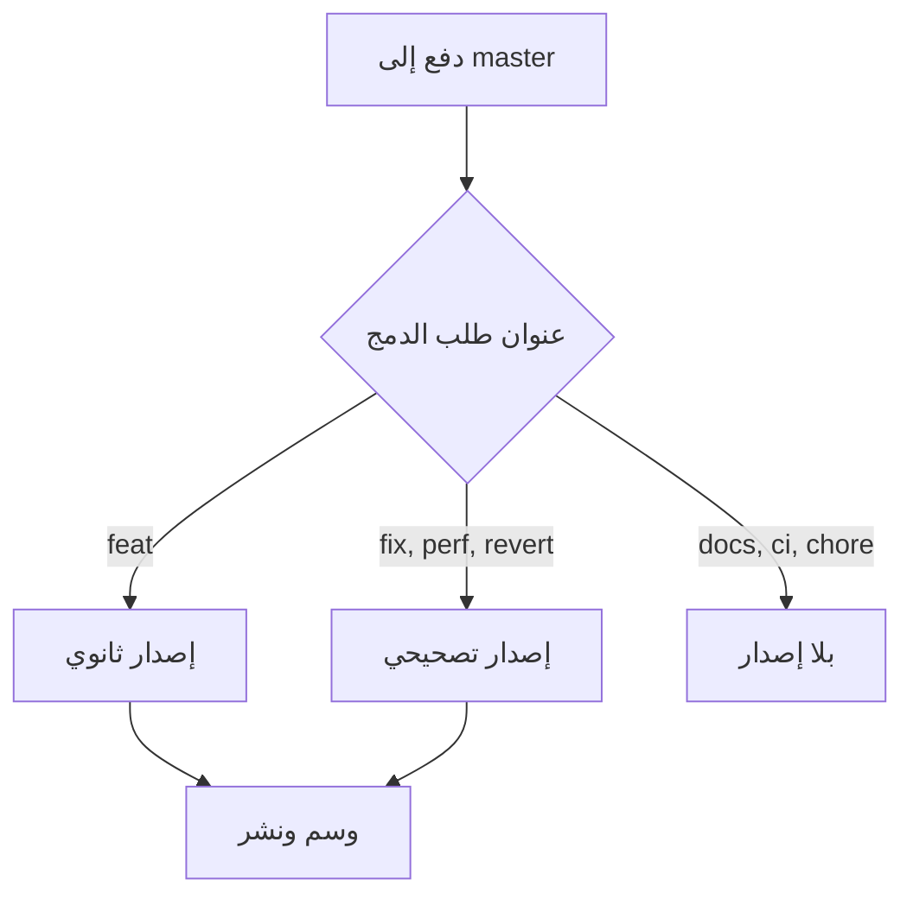

+++
title = "المخططات، وكل ما تبقّى في هذه الصفحة"
description = "مخطّط Mermaid وصورة غلاف وفهرس محتويات وسلسلة، في صفحة واحدة"
date = "2026-02-14"
type = ["posts","post"]
toc = true
cover = "img/cover-diagrams.svg"
coverCaption = "الغلاف هو `cover` في الـ front matter — وهو نفس القيمة التي تستخدمها القائمة للمصغّرة."
tags = ["hugo", "development"]
categories = ["Development"]
series = ["Showcase"]
[author]
  name = "Jane Doe"
+++

هذه الصفحة موجودة كي يُنظر إليها. كل ما فيها خيار من خيارات القالب يتركه العرض
الافتراضي مُطفأً، وهي المكان الوحيد الذي تراها فيه دون تعديل ملف إعدادات أولًا.

## المخطّط

كتلة شيفرة موسومة بـ `mermaid` تصبح مخطّطًا. لا تُحمَّل مكتبة Mermaid من jsDelivr
إلا في الصفحات التي تحتوي مخطّطًا، فالموقع الخالي من المخططات لا يدفع شيئًا مقابل
هذه الميزة.

## فهرس المحتويات

`toc = true` في الـ front matter يضع فهرسًا فوق المقالة. يُبنى من العناوين، فيبقى
مطابقًا للنص من تلقاء نفسه. و`notoc = true` على عنوان بعينه يُبقيه خارجه.

## الغلاف

`cover` يشير إلى صورة، و`coverCaption` يقبل Markdown. القيمة نفسها تُغذّي المصغّرة
في صفحة القائمة عندما يكون `enableThumbnails` مُفعَّلًا: حقل واحد، موضعان، ولا شيء
يحتاج إلى مزامنة.

## وما تبقّى

أسفل هذه المقالة ينبغي أن تجد أزرار المشاركة، ووقت قراءة تقديريًّا، ورابطًا إلى
المقالة السابقة والتالية.

خيار واحد مُستبعَد عن قصد: `gitUrl` مع `enableGitInfo`، وهو يضع أسفل المقالة رابطًا
إلى آخر تعديل غيّر الصفحة. إنه يربط كل بناء بتاريخ المستودع كاملًا، والالتزام الذي
يشير إليه يخصّ القالب لا ما تقرأه أنت. الخيار موثَّق، لكنه غير مُفعَّل.

هذه المقالة جزء من سلسلة أيضًا. السلسلة تصنيف مثل الوسوم والفئات، غير أن صفحة
المقالة لا تسرد سوى الاثنين الأخيرين، فتظهر السلسلة في صفحتها الخاصة لا تحت
العنوان.
