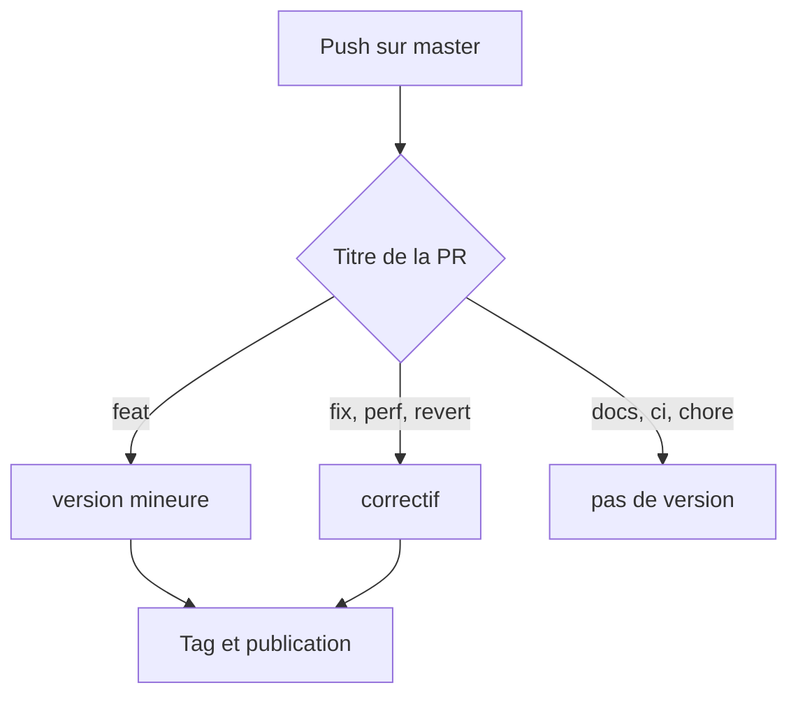

+++
title = "Les diagrammes, et tout le reste de cette page"
description = "Un diagramme Mermaid, une couverture, un sommaire et une série, sur une seule page"
date = "2026-02-14"
type = ["posts","post"]
toc = true
cover = "img/cover-diagrams.svg"
coverCaption = "La couverture, c'est `cover` dans le front matter — la même valeur que la liste utilise pour sa miniature."
tags = ["hugo", "development"]
categories = ["Development"]
series = ["Showcase"]
[author]
  name = "Jane Doe"
+++

Cette page est faite pour être regardée. Tout ce qui s'y trouve est une
fonctionnalité que la démo par défaut laisse éteinte : c'est le seul endroit où
les voir sans commencer par éditer un fichier de configuration.

## Le diagramme

Un bloc de code balisé `mermaid` devient un diagramme. Mermaid n'est chargé
depuis jsDelivr que sur les pages qui en contiennent un, donc un site sans
diagramme ne paie rien pour cette fonctionnalité.

## Le sommaire

`toc = true` dans le front matter en place un au-dessus de l'article. Il est
construit à partir des titres, donc il reste juste tout seul. `notoc = true` sur
un titre l'en exclut.

## La couverture

`cover` désigne une image, `coverCaption` accepte du Markdown. La même valeur
alimente la miniature de la page de liste quand `enableThumbnails` est actif :
un seul champ, deux endroits, rien à synchroniser.

## Et le reste

Sous cet article devraient se trouver les boutons de partage, un temps de
lecture estimé et un lien vers l'article précédent et le suivant.

Une option est volontairement laissée éteinte ici : `gitUrl` avec
`enableGitInfo`, qui ajoute sous l'article un lien vers le commit ayant modifié
la page en dernier. Elle lie chaque build à l'historique complet, et le commit
visé appartient au thème, pas à ce que vous lisez. Elle est documentée, juste
pas activée.

Cet article fait aussi partie d'une série. La série est une taxonomie comme les
tags et les catégories, mais la page d'article ne liste que ces deux dernières :
la série apparaît donc sur sa propre page de listing, pas sous le titre.
