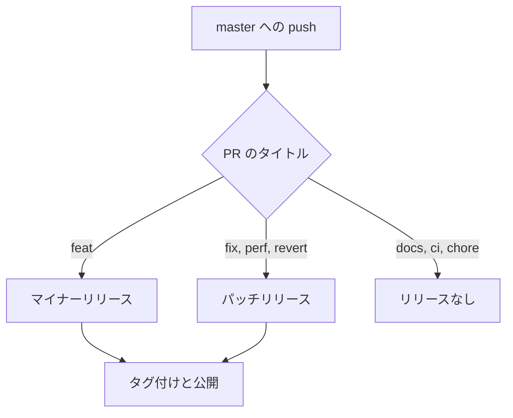

+++
title = "図と、このページにあるすべて"
description = "Mermaid の図、カバー画像、目次、シリーズを 1 ページに"
date = "2026-02-14"
type = ["posts","post"]
toc = true
cover = "img/cover-diagrams.svg"
coverCaption = "カバー画像はフロントマターの `cover` です。一覧のサムネイルが使う値と同じものです。"
tags = ["hugo", "development"]
categories = ["Development"]
series = ["Showcase"]
[author]
  name = "Jane Doe"
+++

このページは見てもらうためにあります。ここにあるものはすべて、既定のデモでは
無効になっているテーマの機能です。設定ファイルを触らずに実物を見られる場所は
ここだけです。

## 図

`mermaid` と付けたコードブロックは図になります。Mermaid は図を含むページでのみ
jsDelivr から読み込まれるので、図のないサイトはこの機能の代償を何も払いません。

## 目次

フロントマターの `toc = true` が記事の上に目次を置きます。見出しから組み立てら
れるので、放っておいても内容とずれません。個々の見出しに `notoc = true` を付け
ると、その見出しは目次に載りません。

## カバー画像

`cover` が画像を指し、`coverCaption` は Markdown を受け付けます。`enableThumbnails`
が有効なとき、同じ値が一覧ページのサムネイルにも使われます。項目はひとつ、
使われる場所はふたつ、同期させるものは何もありません。

## それ以外

この記事の下には共有ボタン、推定の読了時間、前後の記事へのリンクがあるはずです。

ひとつだけ意図的に外してある機能があります。`gitUrl` と `enableGitInfo` は、
ページを最後に変更したコミットへのリンクを記事の下に置くものです。これは
ビルドのたびにコミット履歴全体を必要とし、指し示す先も読者が読んでいるものでは
なくテーマ自身の履歴になります。文書には載っていますが、有効にはしていません。

この記事はシリーズにも属しています。シリーズはタグやカテゴリと同じタクソノミー
ですが、記事ページが並べるのは後者のふたつだけなので、シリーズはタイトルの下では
なく専用の一覧ページに現れます。
