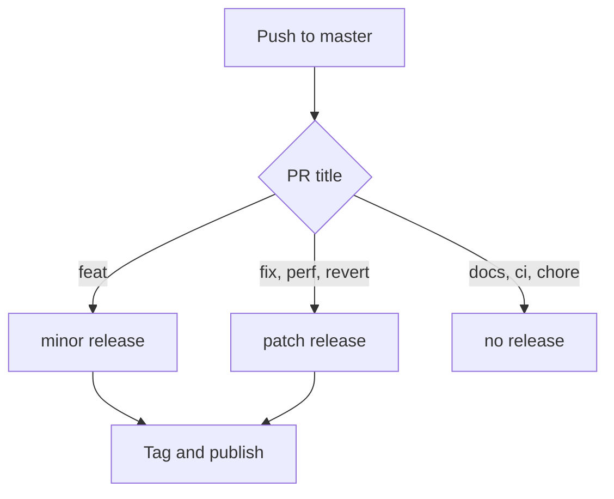

+++
title = "Diagrams, and everything else on this page"
description = "A Mermaid diagram, a cover, a table of contents and a series, on one page"
date = "2026-02-14"
type = ["posts","post"]
toc = true
cover = "img/cover-diagrams.svg"
coverCaption = "The cover is `cover` in the front matter — the same value the list uses for its thumbnail."
tags = ["hugo", "development"]
categories = ["Development"]
series = ["Showcase"]
[author]
  name = "Jane Doe"
+++

This page exists to be looked at. Everything on it is a theme feature that the
default demo leaves switched off, so it is the only place you can see them
without editing a config file first.

## The diagram

A fenced code block tagged `mermaid` becomes a diagram. Mermaid is loaded from
jsDelivr only on pages that contain one, so a site without diagrams pays nothing
for the feature.

## The table of contents

`toc = true` in the front matter puts one above the article. It is built from
the headings, so it stays right on its own. `notoc = true` on a single heading
keeps that heading out of it.

## The cover

`cover` points at an image, `coverCaption` takes Markdown. The same value feeds
the thumbnail on the list page when `enableThumbnails` is on — one field, two
places, nothing to keep in sync.

## The rest of it

Below this article you should find sharing buttons, an estimated reading time,
and a link to the previous and next post.

One option is deliberately left off here: `gitUrl` with `enableGitInfo`, which
puts a link to the commit that last changed a page under the article. It ties
every build to the full commit history, and the commit it points at belongs to
the theme rather than to anything you are reading. It is documented, just not
switched on.

This post is also part of a series. Series is a taxonomy like tags and
categories, but the post page only lists the latter two, so the series shows up
on its own listing page rather than under the title.
